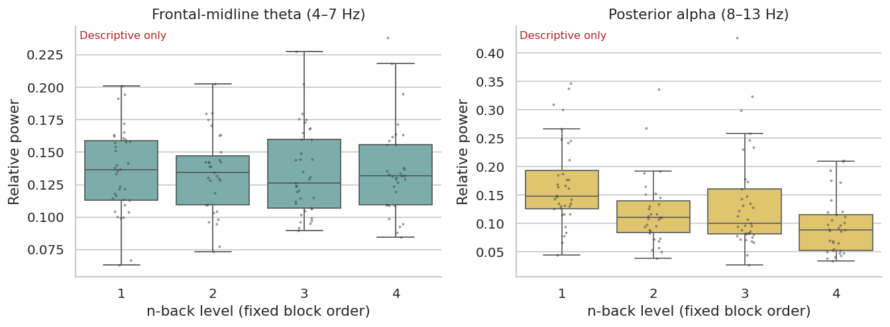

# Reproducible EEG analysis of an n-back workload dataset

A transparent, **single-subject descriptive** EEG preprocessing and analysis
pipeline for [OpenNeuro ds007169 (v1.0.5)](https://openneuro.org/datasets/ds007169/versions/1.0.5),
*Multimodal Cognitive Workload n-back Task, 4 Difficulties*. The repository
turns an audited `sub-001` notebook into reusable modules and a subject CLI.
It does **not** present a validated workload decoder or causal effect of n-back
level. Maintainer: Yuchen Liang.

## Dataset and provenance

The public dataset includes 19-channel EEG at 250 Hz, ECG and pupil recordings
from an n-back task. The original LSL recording is in XDF; BIDS conversion
provides EEG channels and task events. The [dataset README](https://github.com/OpenNeuroDatasets/ds007169)
documents XDF under `sourcedata/xdf/`, subject events under `sub-*/eeg/`, and
100 formal trials at each of four levels, following tutorials. See the
[authors' conversion package](https://github.com/LMBooth/QT-nback_study/tree/main/conversion_package).

The source notebook is an independent audit of `sub-001`; two small figures in
`examples/` are preserved from its outputs to illustrate the pipeline. They
are illustrative results for that participant, not population estimates.
No recordings, event tables or large generated intermediates are included.



## Repository map

| Path | Purpose |
| --- | --- |
| `src/eeg_pipeline/io.py` | Dataset discovery, XDF channel metadata and optional BrainVision numeric comparison |
| `behavior.py`, `qc.py` | Formal-trial selection, signal detection, dropout and channel QC |
| `preprocessing.py` | Scaling, FIR filtering, reference, interpolation and annotations |
| `spectral.py`, `erp.py` | Welch window features and descriptive stimulus-locked ERPs |
| `plotting.py`, `pipeline.py` | Figures and end-to-end orchestration |
| `config/default.yaml` | All timing, QC, preprocessing and analysis settings |
| `notebooks/sub001_demo.ipynb` | Scientific rationale and executable `sub-001` walkthrough |
| `scripts/run_subject.py` | CLI for any released subject |
| `data/README.md` | Data download and layout |

## Install

Python **3.11 or 3.12** is recommended. The original notebook recorded Python
3.12.13, MNE 1.12.1 and pyxdf 1.17.5; `requirements.txt` specifies compatible
ranges rather than promising byte-for-byte equivalence across versions.

```bash
python -m venv .venv
# Activate .venv using your operating system's normal command.
python -m pip install -r requirements.txt
```

For notebook use, install JupyterLab and IPython separately (`python -m pip
install jupyterlab ipython`). Run the notebook from any directory: it resolves
the repository from the location of `src` or a `EEG_PIPELINE_ROOT` environment
variable. The CLI needs no editable installation.

## Prepare the data

Follow [`data/README.md`](data/README.md) and obtain **both** the original XDF
and BIDS event/channel TSVs. An optional BrainVision `.vhdr`/`.eeg` pair lets
the pipeline check the observed conversion scale; it is not the signal source.
Verify that downloaded Git annex files contain data rather than pointers.

## Run

From the repository root:

```bash
python scripts/run_subject.py --subject sub-001 --data-root data/ds007169
python scripts/run_subject.py --subject sub-002 --data-root data/ds007169 --output-root results
python scripts/run_subject.py --help
```

Use `--config config/default.yaml` for an explicit configuration path;
`--no-figures` creates only tables and the summary JSON. Outputs go to
`results/sub-001/` by default and are ignored by Git. Each run writes
`analysis_summary.json`, QC and behavior CSVs, spectral window and summary
CSVs, ERP epoch QC/count CSVs, and seven numbered PNGs when figures are enabled.
Keep any changed YAML with the resulting outputs when comparing runs.

## Prespecified analysis decisions

1. Select only trial markers inside `started_n_back` and `finished_n_back`.
   Report raw accuracy, balanced accuracy and log-linear corrected d′ because
   target prevalence differs by level.
2. Use the **original XDF** as the EEG signal. XDF EEG metadata says
   microvolts; remove each channel's median and multiply by `1e-6` to meet
   MNE's volt convention. The original `sub-001` audit observed a ~`1e7`
   ratio between BrainVision binary counts and XDF numeric values, consistent
   with an export scaling mismatch and 0.1 µV BrainVision resolution. The
   optional comparison is reported per subject; a new unit mismatch stops
   processing instead of applying an unverified correction.
3. Apply 0.5–40 Hz FIR filtering; acquisition already used a 50 Hz notch.
   Screen each channel's filtered 1st–99th percentile range against the
   channel median/MAD (`z > 4`), mark bad channels, average reference while
   excluding them, then spherical-spline interpolate. `sub-001` flagged F7.
   Other participants may differ. No automatic ICA is used without validated
   ocular components or a dedicated EOG channel.
4. Quantify reported acquisition dropouts and keep provenance annotations.
   For spectra use nonoverlapping 4 s windows with ≤5 dropped samples and
   ≤600 µV maximal channel peak to peak amplitude. Welch uses 2 s Hamming
   segments with 50% overlap. Relative 4–7 Hz frontal-midline theta (Fz/Cz)
   and 8–13 Hz posterior alpha (P3/Pz/P4/O1/O2) divide by 1–40 Hz power.
5. Infer letter onset as **marker time minus 1 s**, based on task display and
   marker code, without photodiode confirmation. ERP epochs are −0.2 to 1.0 s
   and baseline corrected at −0.2 to 0 s. Reject epochs with >3 reported
   dropped samples in the original marker−1.2 s to marker QC interval or
   >400 µV maximal channel peak to peak amplitude. Plots show mean ± SEM.

Thresholds, bands, channels and timing live in [`config/default.yaml`](config/default.yaml).
They are analytical choices, not participant-specific tuning targets.

## Interpretation and fixed-order confound

The formal task has **one contiguous block per level**, in the order 1-back,
2-back, 3-back, 4-back. Workload label therefore tracks elapsed time, fatigue,
electrode drift and block order. Observed EEG differences cannot be attributed
uniquely to difficulty. The example figures and per-level tables remain
**descriptive**; `sub-001` alone cannot support population inference.

Ordinary random cross-validation of windows or epochs would put data from the
same contiguous block in both train and test sets, allowing a classifier to
learn block-specific signatures. A within-subject leave-one-block-out split
would remove the **only** block for its class from training. For these reasons
the repository deliberately reports **no ordinary random-CV four-class
workload accuracy**. A multi-participant follow-up needs participant-aware
validation and a design-level discussion of the shared order confound.

## Reproducibility scope

`sub-001` was inspected and previously executed in the uploaded notebook.
This repository contains source and a minimal example, but no raw dataset.
Fresh numerical reproduction requires downloading the data and running the
commands above. The MIT license covers this code and documentation; dataset
reuse follows OpenNeuro's separate terms and citation guidance.
